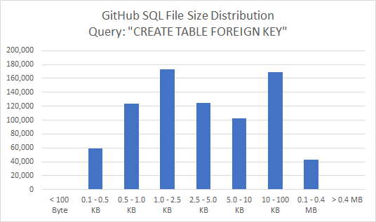

# GitHub Database Schema Dataset

## Introduction
This repository contains scripts to crawl SQL-files from GitHub, parse them and extract structured database schema information from them. We do this, because we want to learn about the semantics of database tables in the wild (table names, column names, foreign key relations etc.). 

Disclaimer: The dataset was created with research problems in the area of large scale data integration in mind, such as foreign key detection, and CSV-header detection. For other use cases, we strongly encourage users to revisit the data collection, parsing and extraction methods and aling them with their concrete research objective.

## Download Links
GitHub SQL Files URL Dataset ([CSV](https://drive.google.com/file/d/1SIKG2Xn64LSOelXYQllGrRxlLX6tzJgi/view?usp=sharing))

GitHub SQL Files Dataset (Upon Request)

Database Schema Dataset ([JSON](https://drive.google.com/file/d/1WRW33SVOper7weXw5sIclsAU20szGoEP/view?usp=sharing))

Foreign Key Detection Training Dataset ([CSV](https://drive.google.com/file/d/1PQv8nDs-zZh04LHE7lPgWfBnmvcWvMFb/view?usp=sharing), [Parquet](https://drive.google.com/file/d/11wAVB1dt9YQGVcFtcrKDyhQGJR09QGAE/view?usp=sharing))


## Crawler
The GitHub SQL Crawler was built using the [GitHub Search API](https://docs.github.com/en/rest/reference/search). We search GitHub for SQL code that contains a CREATE TABLE and a FOREIGN KEY statement to make sure we retrieve SQL scripts which actually define a schema.

The GitHub Search index contains ~7.8M SQL files, out of which ~0.7M contain the "CREATE TABLE FOREIGN KEY" keywords (s. Table).

| Query  | # Search Reults (Nov. 2021)  |
|-------|------------|
| language: SQL  | ~7.8M  |
| keywords: "CREAT TABLE FOREIGN KEY" language: SQL  | ~ 0.8M  |
| keywords: "CREAT TABLE FOREIGN KEY" language: SQL (successfully downloaded) | ~ 0.7M  |
| keywords: "CREAT TABLE FOREIGN KEY" language: SQL (deduplicated)  | ~ 0.37M |

The file-sizes of all SQL scripts containing the desired keywords, are distributed as follows: 



It is Interesting to note is that there are no files >400 KB. Maybe GitHub does not perform language detection on files >400 KB.

The crawler performs the following three steps: 

(1) crawl a list of URLs 

(2) download files based on the list of URLs 

(3) deduplicate the downloaded files based on their [sha256](https://docs.python.org/3/library/hashlib.html) hash 


## SQL Parser
To facilitate downstream use cases, we want to extract structured schema information from the crawled SQL files. This includes things such as table names, column names, primary keys, and foreign keys including their reference table and their reference column names. However, the extraction is no simple feat, because the crawled SQL files may use different SQL dialects, contain comments, be incomplete, and/or contain syntactical errors. 

We tried different parsing options available in Python, including the libraries [sqlparse (Non-validating)](https://github.com/andialbrecht/sqlparse), [mysqlparse (MySQL)](https://github.com/seporaitis/mysqlparse), [pglast (Postgres)](https://github.com/lelit/pglast), and [queryparser (MySQL/Postrgres)](https://github.com/aipescience/queryparser). Untimately, we found`pglast`to provide the best tradeoff between conveniece and parsing success (~16%), leaving us with a total of 61,038 schemas (s. Table).

| Description | # of files |
|-------|------------|
| All SQL files  | 373,156  |
| Parsable with [pglast](https://pypi.org/project/pglast/)  | 61,038 (16.36%)  |

`pglast` extracts an abstract syntax tree ([AST](https://pglast.readthedocs.io/en/v3/ast.html)) from the SQL script, which we ultimately translate to JSON to facilitate further analysis.

Note: There should be quite some room for improvement in terms of the parsing success rate. E.g., backtick-quotes `` ` `` (MySQL-style) are incompatible with the postgres parser and currently lead to an immediate error. While something like this might be easy to solve with a search-and-replace, other issues are more intricate. Since not every SQL-database vedor open sources its parser, it is not feasible to simply trial-and-error for all possible dialects. Maximizing the parsing success rate,_without knowing which particular database system the query was written for_, could be an interesting project in an of itself. Any useful pointers regarding this are highly apprecited.

## Schema Data
The parsing step results in a JSON file which looks as follows. The dataset can be downloaded [here](https://drive.google.com/file/d/1WRW33SVOper7weXw5sIclsAU20szGoEP/view?usp=sharing):

```
{'schema_000001':
	{'INFO': {
		'user': 'user_xxx',
		'url': 'https://github.com/2212khushboo/Project/blob/5a6746d../db/sql/tables.sql?raw=true\n',
		'filename': 'tables.sql',
		'project': 'Project',
		'filesize': 2885},
	 'TABLES': {
	  'state': {
		'COLUMNS': [
			['id', 'serial'],
			['uuid', 'varchar'],
			['state_name', 'varchar']],
	    'PRIMARY_KEYS': ['id'],
	    'FOREIGN_KEYS': []},
	  'address': {
		'COLUMNS': [
			['id', 'serial'],
			['uuid', 'varchar'],
			['flat_buil_number', 'varchar'],
			['locality', 'varchar'],
			['city', 'varchar'],
			['pincode', 'varchar'],
			['state_id', 'int4']],
	    'PRIMARY_KEYS': ['id'],
	    'FOREIGN_KEYS': [{
		 'FOREIGN_KEY': ['state_id'],
		 'REFERENCE_TABLE': 'state',
		 'REFERENCE_COLUMN': ['id']}]}}},
   'schema_000002': {....}
}
```


The following section gives an overview of some of the properties of the dataset. 

| Entity | # |
|-------|------------|
| schemas | 61,038 |
| tables | 393,653 |
| columns| 2,544,164 |
| unique column names | 303,443 |
| primary keys | 322,627 |
| unique primary key names | 31,599 |
| foreign keys | 175,589 |
| unique foreign key names | 31,041 |


Apart from the raw JSON data, we derived a tabular data set particularly for the foreign key detection problem. The dataset contains only those tables, that have a non-composite-key foreign key relation to another table. For tables that have multiple foreign key relations, we added one line for every relation.  It has the following schema and can be downloaded as [csv](https://drive.google.com/file/d/1PQv8nDs-zZh04LHE7lPgWfBnmvcWvMFb/view?usp=sharing) and [parquet](https://drive.google.com/file/d/11wAVB1dt9YQGVcFtcrKDyhQGJR09QGAE/view?usp=sharing) file:

|schema|table_name_a|table_name_b|columns_a|columns_b|primary_keys_a|primary_keys_b|key_a|key_b|
|-------|------------|----|------|------|-------|--------|------|------|
|000361_eventplanline.sql|eventplanline|resourcetbl|planno, lineno, locno, resno, timestart, time...||id|id|resno|resno|
|000376_create_tables.derby.sql|db_category|db_category|id, name, parent_id|id, name, parent_id|id|id|parent_id|id|

total rows: 124605
